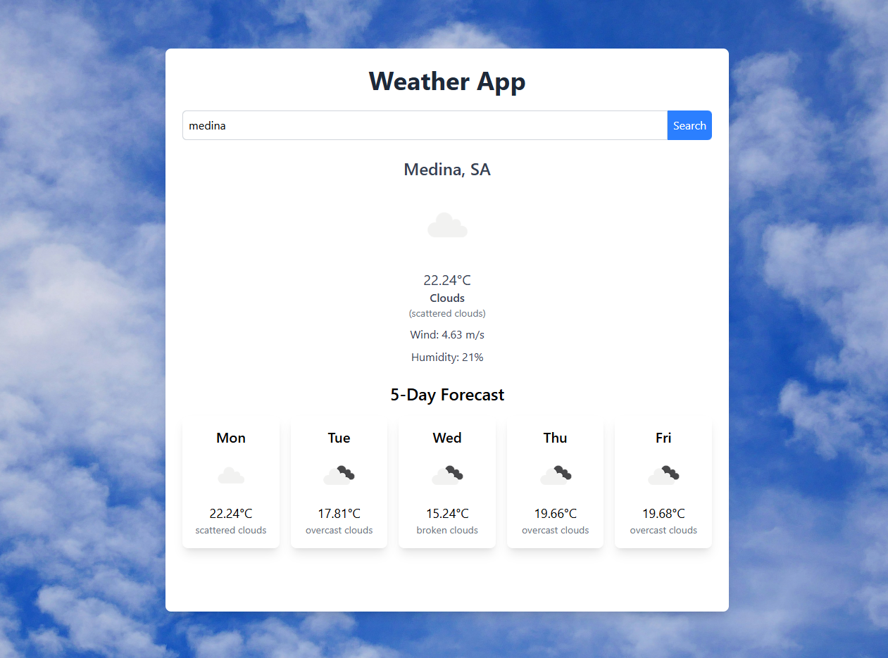

# Weather App 🌤️

This project is a simple Weather Application built using **React.js** and **TailwindCSS**. The app allows users to search for the current weather in a specific city, including real-time temperature, wind speed, humidity, and a 5-day weather forecast.

## Features 🎯

The application includes the following features:

**1. City Search:** Users can search for the current weather by entering the name of a city.

**2. Current Weather:** Displays the current temperature, weather condition, wind speed, and humidity for the selected city.

**3. 5-Day Forecast:** Provides a 5-day weather forecast with temperature, weather condition, and icons.

## Technologies Used ⚙️

- **React.js** for the structure of the app.
- **TailwindCSS** for styling and layout.
- **OpenWeather API** for fetching real-time weather data and forecast.
- **JavaScript (ES6)** for app logic and functionality.

### Screenshot 📸
Here’s a preview of how the Todo App looks:




### Installation 🚀

To run this project locally, follow these steps:

1. Clone the repository:

```
  git clone https://github.com/etharalrehaili/weather.git
```

2. Navigate into the project directory:

```
  cd weather
```

3. Install dependencies:

```
  npm install
```

4. Start the development server:

```
  npm run dev
```

5. Open the app in your browser at http://localhost:3000


